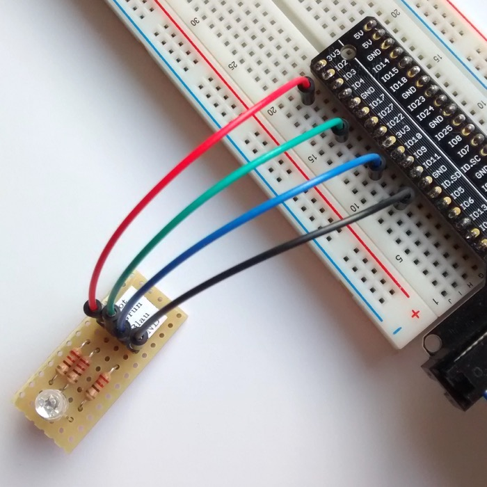
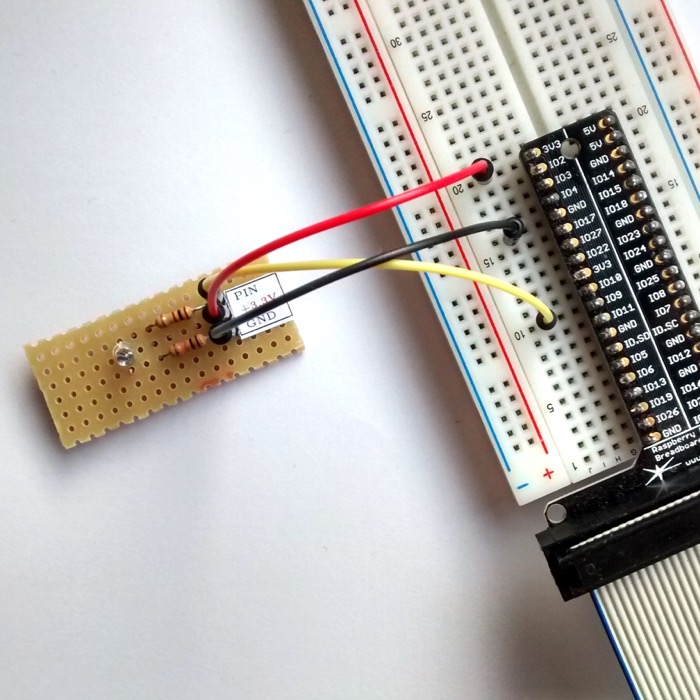
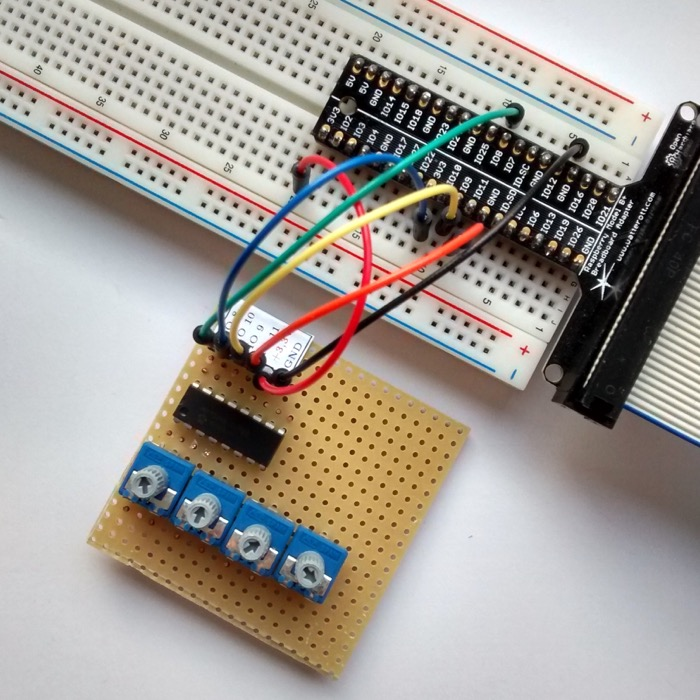

# rpCollection
Java-Objekte zum Anfassen am Raspberry Pi

## Beschreibung
Bei der Objektorientierten Modellierung (OOM) spielen Objekte eine fundamentale Rolle. Der klassische Ansatz im Unterricht arbeitet mit rein virtuellen Objekten - sämtliche Interaktion und auch die Objektkommunikation spielt sich im Rechner ab. Nicht selten kommt es dabei vor, dass man Objekte im wahrsten Sinne des Wortes gar nicht "sieht".

Ziel dieses Projektes ist es, Objekte begreifbar zu machen und Objektkommunikation zu visualisieren. Dafür stehen für den Unterricht Bauteile bereit, mit denen sich verschiedene Szenarien modellieren lassen. Die Schülerinnen und Schüler bekommen so die Möglichkeit, Objekte tatsächlich anzufassen und ihren aktuellen State (Zustand) nicht nur über Methoden zu erfragen, sondern auch zu *sehen* (Bauteil: RGB-LED) oder zu *hören* (Bauteil: Summer).

Auch die Kommunikation ist dabei dabei zu verfolgen. Die Idee ist im folgenden Bild veranschaulicht (pinke Kreise = am Raspberry Pi angeschlossene Bauteile (über Steckbrett), pinke Pfeile = Objektkommunikation).

Die Umsetzung im Unterricht setzt auf Groovy (genauer: die Groovy-Console, aufzurufen über `groovyConsole`), in der sich mit korrekter Java-Syntax mit den Objekten praktisch arbeiten lässt (Objekte erstelen, Objekte modifizieren, Methoden aufrufen, Attribute abfragen etc.).

Es stehen folgende Bauteile (bzw. Objekte) bereit:

* Diode (LED)
* RGB-LED
* Phototransistor
* Taster
* AD-Wandler (für den Anschluss eines MCP3008- / MCP3208-Chips)
* Summer
* Motor (für den Anschluss eines Fischertechnik-Motors)

### Bilder
Im folgenden Bild ist eine angeschlossene RGB-LED zu erkennen. Die Kabel für Rot, Grün und Blau sind farblich abgestimmt, Schwarz ist für Ground (GND).

Bilder sind auch im Ornder

    /Arbeitsblaetter/img/

zu sehen (Anschluss eines Helligkeitssensors, Diode und einer RGB-LED). Weitere Bilder folgen bei Gelegenheit.

<table style="width:100%">
  <tr>
    <td>
    
    
LED

    </td>
    <td>
    
    
RGB-LED

    </td>
    <td>
    
    
Taster

    </td>
  </tr>
  <tr>
    <td>
    
Phototransistor

    </td>
    <td>
    
Summer

    </td>
    <td>
    
AD-Wandler (mit vier Reglern)

    </td>
  </tr>
</table>

## Voraussetzungen
### Hardware
* Raspberry Pi
* GPIO
* Steckbrett
* Kabel zum Anschluss des GPIO an den Raspberry Pi (Flachbandkabel)
* Bauteile (Bauanleitungen und Bilder folgen)

### Software
* Pi4J ([Website](http://pi4j.com))
* WiringPi ([Website](http://wiringpi.com/))
* Groovy ([Website](http://groovy-lang.org/))
* Java

Die Installation kann wie folgt durchgeführt werden:

    sudo apt install openjdk-11-jdk wiringpi snapd
    wget https://pi4j.com/download/pi4j-1.4.deb
    sudo dpkg -i pi4j-1.4.deb

Nach einem Neustart des Raspberry Pi muss noch folgendes nachinstalliert werden:

    sudo snap install groovy --classic

#### Evtl. weitere Software
* LaTeX für den Etikettendruck (falls Bauteile nachgebaut werden sollen oder die Arbeitsblätter kompiliert werden sollen)
* KiCad zum Ausdrucken und Bearbeiten der Schaltpläne ([Website](http://kicad-pcb.org/))

## Anwendung und Beispiel

### Starten

Mit dem Aufruf

    bash start.sh

werden die Java-Dateien kompiliert und die Groovy-Console gestartet, sodass mit den Bauteilen gearbeitet werden kann. Die Pfade für Pi4J sind beim Aufruf bereits eingebunden.

### Beispiel
Durch die Eingaben

    meinLicht = new rpDiode()
    meinLicht.setPin(17)
    meinLicht.an()

wird eine an Pin 17 (BCM-Nummerierung) angeschlossene LED angeschaltet.

Für den Unterricht wurden extra Klassen erstellt, die der Modellierung aus dem Unterricht für das Theater-Arbeitsblatt entsprechen. Beispielsweise greift die Klasse `Scheinwerfer` auf die Klasse `rpDiode` zum Ansteuern einer LED zurück.

So ist es möglich, auf die im Unterricht getroffene Namensvergabe für die modellierten Objekte und Methoden einzugehen.

### Andere Startskripte

#### Groovy-Shell

    bash GSstart.sh

* Starte die Groovy-Shell (mit eingebundenen Pfaden für Pi4J)
* **kein** kompilieren der Java-Klassen (der Aufruf geht damit schneller)

bzw.

    bash GSstartC.sh

* Starte die Groovy-Shell (mit eingebundenen Pfaden für Pi4J)
* **kompilieren** der Java-Klassen
* dieses Skript entspricht dem Standard-Startskript `start.sh`

#### Groovy-Console

     bash GCstart.sh

* Starte die Groovy-Console (mit eingebundenen Pfaden für Pi4J)
* **kein** kompilieren der Java-Klassen (der Aufruf geht damit schneller)

bzw.

     bash GCstartC.sh

* Starte die Groovy-Console (mit eingebundenen Pfaden für Pi4J)
* **kompilieren** der Java-Klassen (der Aufruf geht damit schneller)

## Begleitung durch eine Masterarbeit

Die hier vorgestellten Materialien entstanden überwiegend im Rahmen einer Masterarbeit an der TU Dortmund. Weitere Informationen sind im Ordner

	/Masterarbeit_Heiner_Stroick

zu finden ([Direktlink](/Masterarbeit_Heiner_Stroick/Masterarbeit_Link.md)).

## Lizenz / License
Alle Dateien in diesem Repository steht unter einer *Namensnennung – Nicht-kommerziell – Weitergabe unter gleichen Bedingungen 4.0 International*-Lizenz (sofern nicht anders in der jeweiligen Datei angegeben). Die Bedingungen der Lizenz können unter folgendem Link eingesehen werden: [http://creativecommons.org/licenses/by-nc-sa/4.0/deed.de](http://creativecommons.org/licenses/by-nc-sa/4.0/deed.de)