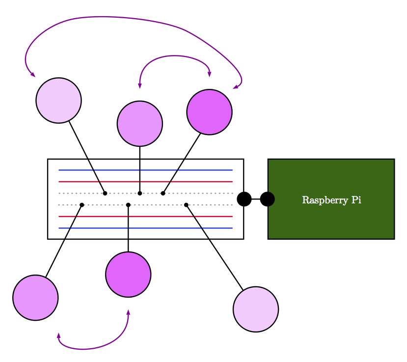

# rpCollection
_**Java-Objekte zum Anfassen**_

## Beschreibung:
Bei der Objektorientierten Modellierung (OOM) spielen Objekte eine fundamentale Rolle. Der klassische Ansatz im Unterricht arbeitet mit rein virtuellen Objekten -- sämtliche Interaktion und auch die Objektkommunikation spielt sich im Rechner ab. Nicht selten kommt es dabei vor, dass man Objekte im wahrsten Sinne des Wortes gar nicht "sieht".

Ziel dieses Projektes ist es, Objekte begreifbar zu machen und Objektkommunikation zu visualisieren. Dafür stehen für den Unterricht Bauteile bereit, mit denen sich verschiedene Szenarien modellieren lassen. Die Schülerinnen und Schüler bekommen so die Möglichkeit, Objekte tatsächlich anzufassen und ihren aktuellen State (Zustand) nicht nur über Methoden zu erfragen, sondern auch zu *sehen* (Bauteil: RGB-LED) oder zu *hören* (Bauteil: Summer). Auch die Kommunikation ist dabei dabei zu verfolgen (pinke Pfeile). Die Idee ist im folgenden Bild veranschaulicht.

Die Umsetzung im Unterricht setzt auf Groovy (genauer: die Groovy-Shell), in der sich mit korrekter Java-Syntax mit den Objekten praktisch arbeiten lässt (Objekte erstelen, Objekte modifizieren, Methoden aufrufen, Attribute abfragen etc.)

Es stehen folgende Bauteile bereit:
* Diode (LED)
* RGB-LED 
* Phototransistor 
* Taster
* AD-Wandler (für den Anschluss eines MCP3008- / MCP3208-Chips)
* Summer
* Motor (für den Anschluss eines Fischertechnik-Motors)

## Voraussetzungen:
### Hardware
* Raspberry Pi
* Bauteile (Bauanleitungen und Bilder folgen)

### Software
* Pi4J (mit dem Raspberry Pi standardmäßig ausgeliefert) [Website](http://pi4j.com$
* WiringPi (wird auch standardmäßig mitgeliefert) [Website](http://wiringpi.com/)
* Groovy (ist i.d.R. noch zu installieren) [Website](http://groovy-lang.org/)

#### Evtl. weitere Software
* LaTeX für den Etikettendruck (falls Bauteile nachgebaut werden sollen)

